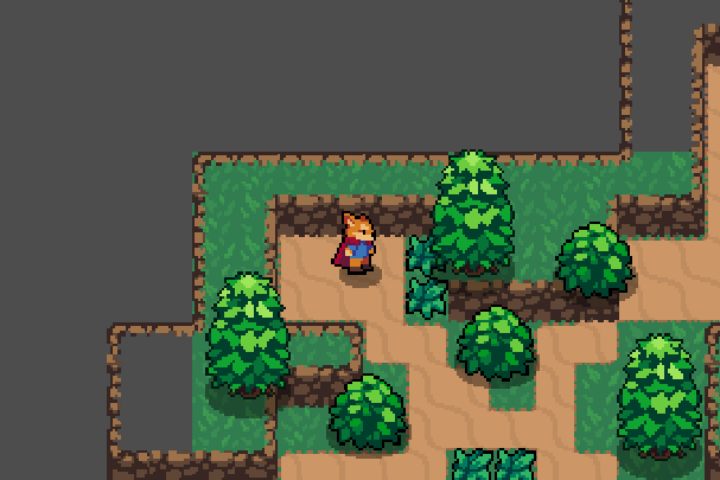
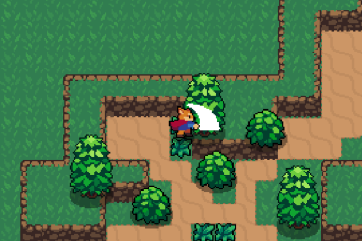
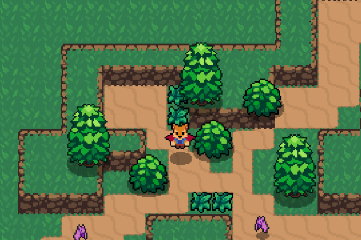
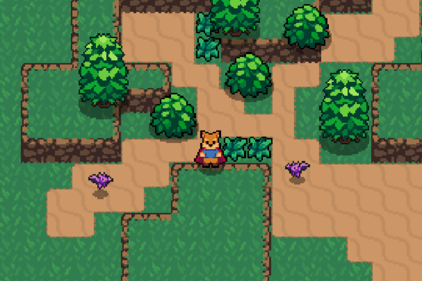
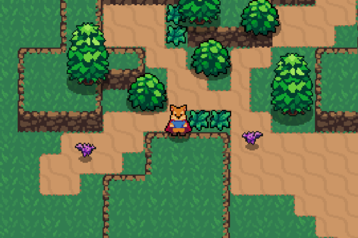

# ARPG

A small top-down action RPG prototype built in Godot. The current build focuses on a readable combat loop with movement, attacks, rolls, enemy pursuit, hit reactions, and destructible map props.

## Gameplay Overview

- Move with `WASD` or the arrow keys.
- Attack with `J` or `X`.
- Roll with `K` or `Z`.
- The player uses directional animations and a state machine to switch between standing, running, attacking, and rolling.
- Enemies chase the player when they have line of sight and react to hits with knockback and a brief hit state.
- Grass objects can be struck and removed, which creates a small visual effect.

## Core Mechanics

### Player

- The player is a `CharacterBody2D`.
- Movement is driven by `Input.get_vector(...)` and the current input direction.
- Combat state is controlled by an `AnimationTree` state machine.
- The player has a `Hitbox` for dealing damage and a `Hurtbox` for receiving damage.
- Health is tracked through a reusable `Stats` resource.
- When hit, the player briefly blinks and the hurtbox is disabled during the blink window.

### Combat

- Damage is handled through overlapping `Area2D` nodes.
- `Hitbox` nodes carry damage, knockback, and optional hit-target tracking.
- `Hurtbox` nodes detect incoming hitboxes and emit a `hurt` signal.
- Attack animations define the strike shape and knockback direction for each facing direction.

### Enemies

- Bat enemies are `CharacterBody2D` nodes with a chase and hit state.
- They use a ray cast to check line of sight to the player.
- When they get hit, they take damage, get knocked back, and temporarily enter a hit animation.

### World

- The main scene is a top-down outdoor area with tile layers, background parallax, foliage props, and enemy spawns.
- The camera follows the player.
- Decorative props such as grass can be interacted with using the same hitbox/hurtbox system.

## Controls

- `WASD` or arrow keys: move
- `J` or `X`: attack
- `K` or `Z`: roll

## Tech Stack

- Engine: Godot 4.6.1
- Language: GDScript
- Rendering: 2D, `canvas_items` stretch mode
- Scene system: `.tscn` scenes with reusable packed scenes
- Animation: `AnimationPlayer` and `AnimationTree`
- Physics: `CharacterBody2D`, `Area2D`, `CollisionShape2D`, `CollisionPolygon2D`
- Data model: custom `Stats` resource for health
- Audio: imported `.wav` and `.mp3` assets for combat and menu feedback

## Project Structure

- `player/` - player scene, sprite sheet, and movement/combat logic
- `enemies/` - bat enemy scene and AI logic
- `world/` - terrain, props, background, and map art
- `damage_boxes/` - reusable hitbox and hurtbox scripts
- `effects/` - hit effects and destroy effects
- `ui/` - heart UI art assets
- `music_and_sounds/` - music and sound effects

## Playtest Captures

Boot and exploration:

Attack state:

Movement during the playtest:

Later exploration frame:

End of capture:

Gameplay video:

- [capture_playtest.avi](capture_playtest.avi)

## Notes

- The build boots successfully in Godot 4.6.1.
- The combat loop is present and playable in the captured footage.
- A visible HUD still looks like a likely next improvement if you want clearer health feedback during play.
